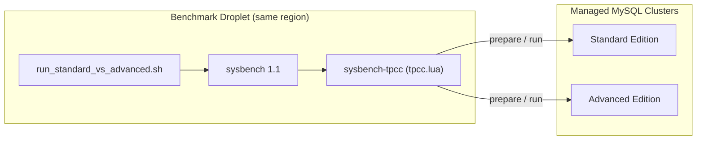
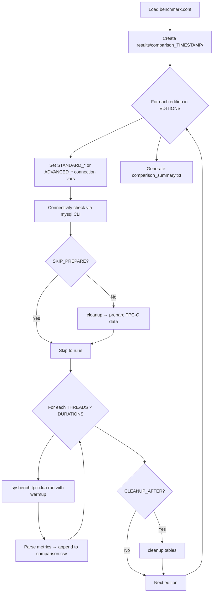

# MySQL Performance Benchmarking Strategy & Methodology

This document describes how we benchmark **DigitalOcean Managed MySQL Standard Edition** against **Advanced Edition** using a repeatable, configurable harness built on **sysbench 1.1** and **sysbench-tpcc**.

---

## 1. Objectives

| Goal | Description |
|------|-------------|
| **Fair comparison** | Run identical workloads against Standard and Advanced clusters under the same conditions |
| **Realistic workload** | Use a write-heavy, multi-statement transactional benchmark (TPC-C-like), not just simple SELECTs |
| **Reproducibility** | All parameters (data size, threads, duration) are config-driven and logged |
| **Managed MySQL compatibility** | SSL required, primary-key constraints respected (Advanced Edition) |

---

## 2. Benchmarking Strategy

### 2.1 Architecture



### 2.2 Methodology Principles

1. **Separate clusters** — Standard and Advanced each get their own DigitalOcean Managed MySQL cluster. Connection details are configured independently in `benchmark.conf`.

2. **Same region** — The benchmark droplet and both database clusters run in the **same DigitalOcean region** to minimize network latency and isolate database-tier differences.

3. **Identical workload** — Both editions receive the same TPC-C dataset size (`TPCC_TABLES`, `TPCC_SCALE`) and the same test matrix (thread counts and durations).

4. **Client-side driver** — sysbench runs from a dedicated droplet (not from the database server itself), simulating application traffic over the network with SSL.

5. **Phased execution** — Each edition goes through: connectivity check → cleanup → prepare (data load) → benchmark runs → optional cleanup.

6. **Concurrency sweep** — Multiple thread counts expose how each edition scales under increasing concurrent load.

7. **Sustained runs** — Each test runs for a configurable duration (e.g. 10 or 20 minutes) plus a warmup period, so results reflect steady-state performance rather than cold-start behavior.

### 2.3 What This Benchmark Measures

- **Throughput** — transactions/sec (TPS) and queries/sec (QPS)
- **Latency** — average and 95th percentile (p95) response time
- **Stability** — errors and reconnects during the run

### 2.4 What This Benchmark Does Not Claim

sysbench-tpcc is **TPC-C-like**, not a formal TPC-C certification benchmark. It does not implement all TPC-C specification requirements (keying time, open-loop scaling, etc.). Results are suitable for **internal edition comparison**, not vendor certification.

---

## 3. Tool Selection

### 3.1 sysbench 1.1+

**Repository:** [akopytov/sysbench](https://github.com/akopytov/sysbench)

| Reason | Detail |
|--------|--------|
| Industry standard | Widely used for MySQL performance testing |
| Lua scripting | Supports custom workloads via `.lua` scripts |
| SSL support (1.1+) | Native `--mysql-ssl=REQUIRED` for DigitalOcean Managed MySQL — no PEM file workarounds |
| Rich metrics | TPS, QPS, latency histograms (avg, p95, p99) |

We build sysbench **1.1 from source** (master branch) via `setup_benchmark.sh` / `install_sysbench_11.sh` and install it to `sysbench-1.1/` in the repo.

**Why not sysbench 1.0?** Version 1.0.x uses `--mysql-ssl=on` and requires dummy certificate files in the working directory. This causes SSL errors against managed MySQL. Version 1.1 aligns with the MySQL client's `--ssl-mode` options.

### 3.2 sysbench-tpcc (Percona-Lab)

**Repository:** [Percona-Lab/sysbench-tpcc](https://github.com/Percona-Lab/sysbench-tpcc)

| Reason | Detail |
|--------|--------|
| TPC-C-like workload | Multi-statement transactions: orders, payments, deliveries, stock — write-heavy |
| sysbench integration | Runs as a Lua script (`tpcc.lua`) — same tooling, metrics, and reporting as sysbench |
| Simpler than tpcc-mysql | No separate C binary; prepare/run/cleanup via standard sysbench commands |
| MySQL + PostgreSQL | Same script supports both via `--db-driver=mysql` |

**Why not tpcc-mysql?** The standalone [tpcc-mysql](https://github.com/Percona-Lab/tpcc-mysql) tool is older, less intuitive, and harder to integrate with managed MySQL SSL. sysbench-tpcc provides equivalent workload characteristics with better operability.

**Why not built-in OLTP scripts?** sysbench's default `oltp_read_write` benchmark is useful for baselines but is simpler (single-table CRUD). TPC-C-like workloads better stress real transactional patterns: joins, contention, and mixed read/write across multiple tables.

---

## 4. Data Size & Workload Parameters

### 4.1 TPC-C Scale Parameters

| Parameter | Meaning | Default (full run) | Quick test |
|-----------|---------|-------------------|------------|
| `TPCC_SCALE` | Number of **warehouses** | `100` | `10` |
| `TPCC_TABLES` | Number of **table sets** (shards) | `10` | `1` |
| `TPCC_FORCE_PK` | Add primary keys (required for Advanced) | `1` | `1` |
| `TPCC_TRX_LEVEL` | Transaction isolation | `RR` (Repeatable Read) | `RR` |

Each warehouse generates TPC-C schema objects (warehouse, district, customer, order, order_line, item, stock, history, new_order tables). With `TPCC_TABLES=10` and `TPCC_SCALE=100`, the benchmark creates a substantial multi-table dataset distributed across 10 table-set shards.

### 4.2 Target Data Sizes

#### Size estimation formula

sysbench-tpcc data size scales with both parameters:

- **`TPCC_SCALE`** — number of warehouses loaded **per table set**
- **`TPCC_TABLES`** — number of independent table sets (each set has its own `warehouse1…N`, `customer1…N`, `stock1…N`, etc.)

Per [Percona’s sysbench-tpcc documentation](https://www.percona.com/blog/tpcc-like-workload-sysbench-1-0/), on **InnoDB without compression**:

```text
Approximate disk size (GB) ≈ TPCC_SCALE × TPCC_TABLES × 0.1
```

Equivalently: **~100 MB per warehouse per table set**, or **~10 GB per 100 warehouses per table set**.

Example: `TPCC_SCALE=100`, `TPCC_TABLES=1` → ~10 GB.  
Example: `TPCC_SCALE=100`, `TPCC_TABLES=10` → ~100 GB.

#### Data size reference table

| `TPCC_TABLES` | `TPCC_SCALE` | **Approx. data size (InnoDB)** | Profile / use case |
|---------------|--------------|--------------------------------|--------------------|
| 1 | 10 | **~1 GB** | Quick smoke test |
| 1 | 50 | **~5 GB** | Medium single-shard test |
| 1 | 100 | **~10 GB** | Single-shard, production-like scale |
| 10 | 10 | **~10 GB** | Multi-shard, moderate total size |
| 10 | 50 | **~50 GB** | Multi-shard, large |
| **10** | **100** | **~100 GB** | **Full comparison (default)** |
| 10 | 1000 | **~1 TB** | Very large (not used by default) |

Actual on-disk size may vary ±10–20% depending on InnoDB page fill, secondary indexes, and `TPCC_FORCE_PK=1` (adds an auto-increment PK on the `history` table).

#### Row counts (per table set)

Each table set contains duplicated TPC-C tables suffixed with the set number (e.g. `customer1`, `customer2`). Row counts **per table set** follow sysbench-tpcc constants (`DIST_PER_WARE=10`, `CUST_PER_DIST=3000`, `MAXITEMS=100000`):

| Table | Rows per table set |
|-------|-------------------|
| `item` | 100,000 (fixed) |
| `stock` | `TPCC_SCALE × 100,000` |
| `warehouse` | `TPCC_SCALE` |
| `district` | `TPCC_SCALE × 10` |
| `customer` | `TPCC_SCALE × 30,000` |
| `history` | `TPCC_SCALE × 30,000` |
| `orders` | `TPCC_SCALE × 30,000` |
| `order_line` | `TPCC_SCALE × ~300,000` (~10 lines per order) |
| `new_orders` | `TPCC_SCALE × ~9,000` (last 900 orders per district) |

**Total rows scale linearly with `TPCC_TABLES`** — each additional table set adds another full copy of the schema and warehouse data.

Example for **`TPCC_TABLES=1`, `TPCC_SCALE=10`** (quick test, ~1 GB):

- 10 warehouses, 100 districts, 300,000 customers per table set
- 1,000,000 stock rows, 100,000 item rows

Example for **`TPCC_TABLES=10`, `TPCC_SCALE=100`** (full run, ~100 GB):

- 1,000 warehouses total (100 per table set × 10 sets)
- ~30 million customer rows total across all sets
- ~100 million stock rows total

#### Recommended profiles (size + runtime)

| Profile | `TPCC_TABLES` | `TPCC_SCALE` | **Data size** | Use case | Approx. prepare time |
|---------|---------------|--------------|---------------|----------|---------------------|
| **Quick smoke test** | 1 | 10 | **~1 GB** | Validate setup & connectivity | ~5–15 min |
| **Quick compare (~1 hr)** | 1 | 10 | **~1 GB** | Standard vs Advanced, 2 thread levels | ~35–55 min total |
| **Full comparison** | 10 | 100 | **~100 GB** | Production-like comparison | ~30–90 min prepare per edition |

The **full comparison** profile (`TPCC_TABLES=10`, `TPCC_SCALE=100`, **~100 GB per edition**) is the default in `benchmark.conf.example`. At ~100 GB, the dataset is large enough that it typically **does not fit entirely in the buffer pool** on common managed MySQL cluster sizes, producing meaningful I/O, cache pressure, and row contention — which is the intent of this profile.

Each edition (Standard and Advanced) is prepared **independently** on its own cluster, so plan cluster storage for **~100 GB per cluster** for the full profile (plus headroom for redo logs and temporary load overhead during prepare).

#### Verify actual size after prepare

After prepare completes, check live size on the database:

```sql
SELECT
  ROUND(SUM(data_length + index_length) / 1024 / 1024 / 1024, 2) AS size_gb
FROM information_schema.tables
WHERE table_schema = 'benchmark';
```

Or per table:

```sql
SELECT
  table_name,
  ROUND((data_length + index_length) / 1024 / 1024, 1) AS size_mb
FROM information_schema.tables
WHERE table_schema = 'benchmark'
ORDER BY (data_length + index_length) DESC
LIMIT 20;
```

### 4.3 Test Matrix (Concurrency & Duration)

| Parameter | Meaning | Default (full) | Quick |
|-----------|---------|----------------|-------|
| `THREADS` | Concurrent sysbench threads (clients) | `"8 16 32 64"` | `"4 8"` |
| `DURATIONS` | Run time per test in **seconds** | `"600 1200"` (10m, 20m) | `"300"` (5m) |
| `WARMUP_SEC` | Warmup before measured run | `60` | `30` |
| `PREP_THREADS` | Parallel threads during data load | `16` | `4` |

**Full run:** 4 thread levels × 2 durations × 2 editions = **16 benchmark runs**, plus 2 prepare phases.

**Estimated total time (full, both editions):** ~5–7 hours on an 8 vCPU droplet.

---

## 5. Infrastructure Setup

### 5.1 Benchmark Droplet

| Requirement | Recommendation |
|-------------|----------------|
| **OS** | Ubuntu 22.04 / 24.04 |
| **Region** | Same as both MySQL clusters |
| **Size** | Minimum **8 vCPU / 16 GB RAM** for full runs |
| **Network** | Droplet IP added to each cluster's **Trusted Sources** |

The droplet is the **only** client running sysbench. It must not be resource-starved, or results will reflect droplet limits rather than database performance.

### 5.2 Database Clusters

| Edition | Config prefix | Notes |
|---------|---------------|-------|
| Standard Edition | `STANDARD_MYSQL_*` | Separate DO Managed MySQL cluster |
| Advanced Edition | `ADVANCED_MYSQL_*` | Separate cluster; often has `sql_require_primary_key=ON` |

Each cluster needs:

- A dedicated database (e.g. `benchmark`) — create via **Users & Databases** in the DO control panel
- SSL on port **25060** (typical for DO managed MySQL)
- Droplet IP in **Trusted Sources**

---

## 6. Configurable Parameters

All settings live in `benchmark.conf` (copy from `benchmark.conf.example`).

### 6.1 Connection Settings

```ini
# Standard Edition
STANDARD_MYSQL_HOST=...
STANDARD_MYSQL_PORT=25060
STANDARD_MYSQL_USER=doadmin
STANDARD_MYSQL_PASSWORD=...
STANDARD_MYSQL_DB=benchmark

# Advanced Edition
ADVANCED_MYSQL_HOST=...
ADVANCED_MYSQL_PORT=25060
ADVANCED_MYSQL_USER=doadmin
ADVANCED_MYSQL_PASSWORD=...
ADVANCED_MYSQL_DB=benchmark
```

### 6.2 Dataset & Workload

| Variable | Description |
|----------|-------------|
| `TPCC_TABLES` | Number of table sets |
| `TPCC_SCALE` | Number of warehouses |
| `TPCC_FORCE_PK` | `1` = add PKs to history table (required for Advanced) |
| `TPCC_TRX_LEVEL` | Transaction isolation: `RR`, `RC`, etc. |

### 6.3 Test Matrix

| Variable | Description |
|----------|-------------|
| `THREADS` | Space-separated concurrency levels, e.g. `"8 16 32 64"` |
| `DURATIONS` | Space-separated run durations in seconds, e.g. `"600 1200"` |
| `WARMUP_SEC` | Seconds of warmup before metrics are collected |
| `PREP_THREADS` | Parallelism during data load (prepare phase) |
| `TPCC_REPORT_INTERVAL` | Seconds between progress reports during a run |

### 6.4 Run Behavior

| Variable | Values | Description |
|----------|--------|-------------|
| `EDITIONS` | `"standard"`, `"advanced"`, or `"standard advanced"` | Which edition(s) to benchmark |
| `SKIP_PREPARE` | `0` or `1` | `1` = skip cleanup/prepare and run against existing data |
| `CLEANUP_AFTER` | `0` or `1` | `1` = drop TPC-C tables after all runs complete |

**When to use `SKIP_PREPARE=1`:**

- A previous run already loaded data and was interrupted during benchmark runs
- Re-running tests without waiting for another data load
- Standard edition already has data from a prior quick run

**Caution:** If dataset parameters (`TPCC_TABLES`, `TPCC_SCALE`) change, set `SKIP_PREPARE=0` to reload data.

---

## 7. Metrics Collected

Parsed from each sysbench run and written to `comparison.csv`:

| Metric | sysbench output | Description |
|--------|-----------------|-------------|
| **TPS** | `transactions:` | Transactions per second |
| **QPS** | `queries:` | SQL statements per second |
| **Avg latency** | `avg:` | Mean transaction latency |
| **P95 latency** | `95th percentile:` | 95th percentile latency |
| **P99 latency** | `99th percentile:` | 99th percentile latency |
| **Total transactions** | `total number of transactions:` | Count over the run |
| **Errors** | `errors:` | Failed transactions |
| **Reconnects** | `reconnects:` | Connection reconnects |

The summary report (`comparison_summary.txt`) includes a head-to-head TPS comparison per thread/duration combination.

---

## 8. Script Architecture & How It Works

### 8.1 Repository Layout

```
mysql-benchmark/
├── setup_benchmark.sh          # One-time: install deps, sysbench 1.1, clone sysbench-tpcc
├── install_sysbench_11.sh      # Builds sysbench 1.1 from source
├── benchmark.conf.example      # Config template
├── benchmark.conf              # Your credentials & settings (not committed)
├── run_standard_vs_advanced.sh # Main orchestrator
├── lib/
│   └── benchmark_common.sh     # Shared: config, connectivity, TPC-C runs, parsing
├── sysbench_mysql_opts.sh      # SSL-aware sysbench MySQL connection builder
├── sysbench-1.1/               # Installed sysbench binary (after setup)
├── TPCC/sysbench-tpcc/         # Cloned tpcc.lua workload scripts
└── results/
    └── comparison_<timestamp>/ # Output per run
        ├── comparison.csv
        ├── comparison_summary.txt
        ├── full_run.log
        ├── standard/
        │   ├── mysql_info.txt
        │   ├── prepare.log
        │   └── run_8t_600s.txt
        └── advanced/
            └── ...
```

### 8.2 Execution Flow



### 8.3 Key Scripts

#### `setup_benchmark.sh`

One-time setup on the droplet:

1. Installs build dependencies (`apt` on Ubuntu)
2. Builds sysbench 1.1 via `install_sysbench_11.sh`
3. Clones [sysbench-tpcc](https://github.com/Percona-Lab/sysbench-tpcc) to `TPCC/sysbench-tpcc/`
4. Verifies installation

#### `run_standard_vs_advanced.sh`

Main benchmark orchestrator:

1. Loads `benchmark.conf`
2. Creates a timestamped results directory
3. For each edition (`standard`, `advanced`):
   - Sets connection variables from `STANDARD_MYSQL_*` or `ADVANCED_MYSQL_*`
   - Verifies connectivity
   - Optionally cleans up and prepares TPC-C data
   - Runs the full thread × duration matrix
   - Optionally cleans up tables
4. Writes `comparison.csv` and `comparison_summary.txt`

#### `lib/benchmark_common.sh`

Shared library:

- `load_benchmark_config` — sources `benchmark.conf`
- `set_mysql_env_for_edition` — maps edition name to config variables
- `mysql_connectivity_check` — validates SSL connection
- `run_tpcc_command` — invokes `sysbench tpcc.lua prepare|run|cleanup`
- `parse_sysbench_metrics` — extracts TPS, QPS, latency from run logs
- `write_comparison_summary` — generates human-readable report

#### `sysbench_mysql_opts.sh`

- Detects sysbench version and sets SSL mode (`--mysql-ssl=REQUIRED` for 1.1+)
- Builds MySQL connection arguments lazily (after edition config is loaded)
- Provides `run_sysbench_tpcc()` which runs from the sysbench-tpcc directory (required for Lua `require`)

### 8.4 What sysbench-tpcc Does Under the Hood

**Prepare:**

```bash
sysbench tpcc.lua \
  --db-driver=mysql \
  --mysql-host=... --mysql-port=... --mysql-user=... --mysql-password=... --mysql-db=... \
  --mysql-ssl=REQUIRED \
  --tables=10 --scale=100 --force_pk=1 \
  --threads=16 \
  prepare
```

Creates warehouse, district, customer, stock, order, and related tables; loads data in parallel.

**Run:**

```bash
sysbench tpcc.lua \
  ... \
  --threads=32 --time=600 --warmup-time=60 --report-interval=10 \
  run
```

Executes TPC-C-like transactions (new order, payment, delivery, order status, stock level) for the specified duration.

---

## 9. How to Run

### 9.1 One-Time Setup

```bash
cd ~/mysql-benchmark
./setup_benchmark.sh
cp benchmark.conf.example benchmark.conf
# Edit benchmark.conf with Standard & Advanced credentials
```

### 9.2 Run Benchmark (recommended: background)

```bash
export PATH="$PWD/sysbench-1.1/bin:$PATH"
nohup ./run_standard_vs_advanced.sh > benchmark.out 2>&1 &
tail -f benchmark.out
```

Using `nohup` ensures the benchmark continues if your SSH session disconnects or your laptop locks.

### 9.3 View Results

```bash
cat results/LATEST_COMPARISON.txt
cat results/comparison_*/comparison_summary.txt
cat results/comparison_*/comparison.csv
```

---

## 10. Recommended Run Profiles

### Quick smoke test (~15 min, Standard only)

```ini
TPCC_TABLES=1
TPCC_SCALE=10
THREADS="4 8"
DURATIONS="300"
WARMUP_SEC=30
PREP_THREADS=4
EDITIONS="standard"
```

### Quick Standard vs Advanced (~45–60 min)

```ini
TPCC_TABLES=1
TPCC_SCALE=10
THREADS="4 8"
DURATIONS="300"
WARMUP_SEC=30
PREP_THREADS=4
EDITIONS="standard advanced"
```

### Full comparison (~5–7 hours)

```ini
TPCC_TABLES=10
TPCC_SCALE=100
THREADS="8 16 32 64"
DURATIONS="600 1200"
WARMUP_SEC=60
PREP_THREADS=16
EDITIONS="standard advanced"
SKIP_PREPARE=0
```

---

## 11. Best Practices & Limitations

### Best Practices

- Use a droplet with **8+ vCPU / 16+ GB RAM** for full runs
- Keep droplet and databases in the **same region**
- Use **`nohup`** or **`screen`** for long runs
- Use **`SKIP_PREPARE=1`** only when data is already loaded with matching `TPCC_TABLES` / `TPCC_SCALE`
- Run each edition against a **separate cluster** with identical dataset parameters

### Limitations

- Results reflect **client-driven** load from one droplet; not a distributed load test
- sysbench-tpcc is **TPC-C-like**, not formal TPC-C
- Droplet CPU/memory can become the bottleneck on undersized VMs
- Network latency between droplet and DB is included in latency measurements
- `SKIP_PREPARE` applies to all editions in a single run (no per-edition skip)

---

## 12. References

- [sysbench](https://github.com/akopytov/sysbench)
- [sysbench-tpcc (Percona-Lab)](https://github.com/Percona-Lab/sysbench-tpcc)
- [TPC-C-like workload for sysbench (Percona blog)](https://www.percona.com/blog/tpcc-like-workload-sysbench-1-0/)
- [DigitalOcean Managed MySQL](https://docs.digitalocean.com/products/databases/mysql/)
