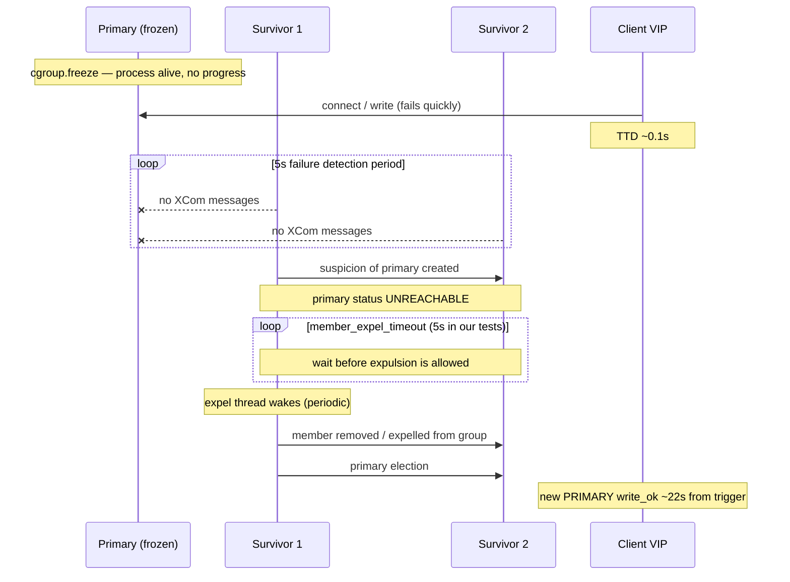

# mysqld_freeze Failover — Mechanism, GR Expel Path, and Experiment Results

**Cluster:** DigitalOcean Advanced MySQL `bkp-my-5tb-n3` (3-node Group Replication, ~5 TB TPC-C)  
**Harness trigger:** `FAILOVER_ADVANCED_TRIGGER_METHOD=mysqld_freeze`  
**Related summary:** [FAILOVER_TEST_SUMMARY.md](./FAILOVER_TEST_SUMMARY.md)

---

## 1. What is `mysqld_freeze`?

`mysqld_freeze` is an **unplanned** failover trigger in the mysql-benchmark harness. It simulates a **hung primary** — mysqld is still running, but it cannot respond to the group or to clients.

Instead of killing the process or deleting the pod, the harness:

1. Schedules a **privileged helper pod** on the same Kubernetes node as the current PRIMARY.
2. Resolves the primary’s **containerd task** for the `mysql` container.
3. **Freezes** that container via Linux cgroup (`cgroup.freeze` on cgroup v2, legacy freezer, or host `SIGSTOP` as fallback).
4. **Holds** the freeze for a configured duration (25 s in our 20-iteration experiment).
5. **Thaws** (unfreezes) the container after the hold — cleanup only; failover has already completed on survivors.

Implementation: `trigger_failover.sh` → `_advanced_failover_freeze_mysqld()`.

```text
Primary mysqld (frozen)          Survivor GR members
        |                                |
   no heartbeats  ----------------->  suspicion created
   no client I/O  ----------------->  VIP connect_ok=0 (TTD)
   still in memory                     UNREACHABLE → expel wait → expel → election
```

**Why cgroup freeze instead of in-pod kill?** When mysqld is PID 1 inside the container, in-pod signals (`SIGSTOP`/`SIGKILL`) are unreliable. Freezing from the **host node cgroup** reliably pauses all container processes.

---

## 2. Why there is no shutdown signal — and why that matters

Group Replication distinguishes two broad failure modes:

| Mode | Primary state | GR behavior | Typical failover time (our cluster) |
|------|---------------|-------------|-------------------------------------|
| **Immediate member loss** | Process/pod gone | Member disappears from group; election can proceed quickly | ~2–3 s (`pod_delete`) |
| **Unreachability / expel** | Process alive but not responding | Suspicion → expel timeout → expel → election | ~22 s (`mysqld_freeze`) |

### What “shutdown signal” means in GR

When mysqld receives a **controlled shutdown** (e.g. `SIGTERM`, graceful `STOP GROUP_REPLICATION`, or operator-initiated leave), it can:

- Send a **leave message** to the group
- Allow survivors to **reconfigure membership** without treating the member as failed
- Often trigger a **fast, planned** primary change

With `mysqld_freeze`, **none of that happens**:

- mysqld is **not terminated** and **not asked to leave**
- The frozen process cannot send or receive XCom/GR messages
- From survivors’ perspective, the primary simply **stops answering heartbeats**
- The member stays in the membership list as **`UNREACHABLE`** until explicitly **expelled**

So `mysqld_freeze` deliberately exercises the **UNREACHABLE / expel path** — the same class of failure as network partition, firewall block, or I/O hang — not the “member vanished” path.

### What the client sees vs what GR sees

These timelines diverge:

- **Client (VIP monitor):** TTD is very fast (~0.1 s avg) because a frozen mysqld stops accepting connections almost immediately.
- **Group Replication:** Failover cannot complete until suspicion, expel timeout, and expel processing finish — roughly **~22 s** on our cluster.

Most of the promote window is therefore **GR suspicion & expel**, not client detection or GR election itself.

---

## 3. Group Replication failure detection — step by step

When the primary stops sending messages (because it is frozen), each survivor runs through this sequence:



### Phase A — Initial failure detection (~5 s)

MySQL GR uses a **5-second detection period** before creating a **suspicion** of another member ([Failure Detection](https://dev.mysql.com/doc/refman/8.4/en/group-replication-failure-detection.html)).

- If a member receives **no messages** from a peer for 5 seconds, it creates a suspicion when that period ends.
- The suspected member is reported as **`UNREACHABLE`** in `performance_schema.replication_group_members`.
- Our harness parses survivor mysqld logs for: `has become unreachable`.

This 5 s window exists to tolerate transient network jitter; it is **not** configurable via a simple user-facing variable (unlike `member_expel_timeout`).

### Phase B — `group_replication_member_expel_timeout` (~5 s in our tests)

After a suspicion is **created**, GR waits an additional interval before the member may be **expelled**. That interval is controlled by:

```sql
group_replication_member_expel_timeout = 5   -- seconds (our experiment)
```

#### What the variable controls

| Aspect | Detail |
|--------|--------|
| **Starts counting from** | Suspicion **creation** (after the initial 5 s detection period) |
| **During the wait** | Member is `UNREACHABLE` but **still in the membership list** |
| **When it expires** | Member becomes **liable for expulsion** — not necessarily expelled instantly |
| **Default (MySQL 8.0.21+)** | **5** seconds → minimum ~**10 s** from last message to expulsion liability (5 s detect + 5 s expel timeout) |
| **If set to 0** | No extra wait; liable immediately after the 5 s detection period (~5 s total) |
| **Maximum** | 3600 s (1 hour) |
| **Per-member setting** | Any member can suspect any other; **effective timeout = lowest value among members** |

#### Why this variable exists

Failure detection over TCP is **unreliable** — a member may look dead due to a brief network blip. `group_replication_member_expel_timeout` adds a **grace period** after suspicion so a temporarily silent member can:

- Resume communication
- Receive buffered XCom messages from survivors
- Rejoin as the **same incarnation** without operator action

If the member is still silent when the expel timeout expires (as with `mysqld_freeze`), expulsion proceeds.

#### Our configuration

For the 20-iteration `mysqld_freeze` run we set:

- `group_replication_member_expel_timeout=5` on the **Percona CR**
- `SET PERSIST` on **all three pods** so runtime matches CR

This matches the MySQL 8.0.21+ default and gives a predictable ~10 s minimum before expulsion liability.

---

## 4. The expel thread and its check interval

Expulsion is **not instantaneous** when the expel timeout expires. MySQL’s Group Communication System (GCS) runs a dedicated **suspicions processing thread** (`Gcs_suspicions_manager`).

### What the thread does

On each wake-up, the thread:

1. Reads the current time
2. Checks all active **suspicions**
3. Removes members whose suspicions have **timed out** (expel timeout elapsed)
4. Drives a **membership view change** so survivors can elect a new primary

Relevant MySQL server API: `Gcs_suspicions_manager::process_suspicions()` — *“Invoked periodically by the suspicions processing thread… verifies which suspect nodes should be removed as they have timed out.”*

### Default check interval: 15 seconds

In MySQL GCS source (`gcs_xcom_control_interface.cc`):

```cpp
static const unsigned int SUSPICION_PROCESSING_THREAD_PERIOD = 15;
```

So the suspicions thread sleeps **15 seconds between iterations** by default. This is the **`suspicions_processing_period`** — configurable internally via `set_suspicions_processing_period()`, but **not exposed as a user-facing mysqld variable** in standard deployments.

### How the 15 s interval affects total failover time

After expel timeout expires, the member is **eligible** for expulsion, but actual removal waits for the **next thread wake-up**:

| Expel timeout expires at… | Expel thread last ran at… | Extra wait until expulsion |
|---------------------------|---------------------------|----------------------------|
| Just after a wake-up | T | **up to ~15 s** |
| Just before a wake-up | T − 14 s | **~1 s** |
| Average case | — | **~7–8 s** |

MySQL documents this as: *“A further short period of time might elapse after that before the expelling mechanism detects and implements the expulsion.”* ([Expel Timeout docs](https://dev.mysql.com/doc/refman/8.4/en/group-replication-responses-failure-expel.html))

### Putting the timeline together (why ~22 s)

Approximate minimum from trigger (heartbeats stop at freeze):

```text
 0 s   Freeze applied; client TTD ~0.1 s
 5 s   Suspicion created (failure detection)
10 s   Expel timeout expires (5 + 5); member liable for expulsion
10–25 s  Expel thread removes member (0–15 s jitter)
~22 s   Election + HAProxy routing + VIP write_ok (typical in our data)
```

**Rough formula:**

```text
total_failover ≈ 5 (detect)
               + member_expel_timeout
               + expel_thread_jitter (0–15 s, avg ~7 s)
               + election + HA routing (~0.5–2 s)
```

With `member_expel_timeout=5` and default 15 s thread period, **~22 s average** is expected — not a bug.

If `member_expel_timeout=0`, you still pay **5 s detect + up to ~15 s thread jitter**, so total can still be ~15–20 s unless other factors change.

---

## 5. What happens after expulsion

Once survivors remove the frozen primary from the group:

1. **Primary election** — typically sub-second in our promotion breakdown once the member is gone.
2. **HAProxy routing** — new backend marked UP on `mysql-primary` pool (`check inter 2000 rise 1 fall 2`).
3. **VIP write probe** — client path sees new hostname + `write_ok=1` → **total failover** end.

On the **frozen primary** (after thaw):

- It resumes with an outdated view; GR tells it it was **expelled**.
- With default `group_replication_autorejoin_tries=3`, it may attempt auto-rejoin.
- In our benchmark, thaw happens **after** survivors have already failed over.

---

## 6. Harness configuration for our experiment

### Trigger settings

| Parameter | Value |
|-----------|-------|
| `FAILOVER_ADVANCED_TRIGGER_METHOD` | `mysqld_freeze` |
| `FAILOVER_MYSQLD_FREEZE_SEC` | **25** (hold ≥ detect + expel + buffer) |
| `FAILOVER_MYSQLD_FREEZE_THAW` | **1** (unfreeze after hold) |
| Freeze mechanism | Host cgroup v2 `cgroup.freeze` via privileged helper pod |

The 25 s hold ensures the primary stays frozen through the full UNREACHABLE → expel → election sequence even if the expel thread is slow.

### Workload (same as `pod_delete` baseline run)

| Parameter | Value |
|-----------|-------|
| Scenario | `read_heavy_fat` (90% read / 10% write, ~20 MiB/s) |
| `TPCC_FAT_READ_ROWS` | 150 |
| Threads | 16 |
| Scale | 5000 warehouses (~5 TB) |
| Per iteration | 60 s warmup + 300 s baseline + trigger + 300 s observe + 300 s delay |
| Secondary warmup | `read_only_fat` on HAProxy `:3307` during 300 s inter-iteration gap |
| GR expel timeout | `group_replication_member_expel_timeout=5` |

### Results location

| Run | Iterations | Results directory | HTML report |
|-----|------------|-------------------|-------------|
| 20-iter production run | 20 | `results/failover_20260730_194553` | `advanced/mixed/graphs/failover_report.html` |
| 1-iter smoke | 1 | `results/failover_20260730_191608` | (smoke validation) |

---

## 7. Experiment results — time to failover

### KPI definitions

All times in **seconds from trigger** (`FAILOVER_TRIGGER_EPOCH`):

| KPI | Column | Meaning |
|-----|--------|---------|
| **Time to detect (TTD)** | `failure_detection_sec` | Trigger → first VIP sample with `connect_ok=0` |
| **Time to promote** | `primary_election_sec` | TTD → new PRIMARY on VIP with `write_ok=1` |
| **Total failover** | `total_failover_sec` | Trigger → promote end (≈ TTD + promote) |

### Per-iteration results (20 iterations)

| Iter | Time to detect (s) | Time to promote (s) | Total failover (s) |
|------|-------------------:|--------------------:|-------------------:|
| 1 | 0.105 | 22.500 | 22.610 |
| 2 | 0.012 | 23.750 | 23.760 |
| 3 | 0.107 | 21.750 | 21.860 |
| 4 | 0.015 | 24.000 | 24.010 |
| 5 | 0.416 | NOT_DETECTED | NOT_DETECTED |
| 6 | 0.196 | 22.750 | 22.950 |
| 7 | 0.395 | NOT_DETECTED | NOT_DETECTED |
| 8 | 0.047 | 22.000 | 22.050 |
| 9 | 0.207 | 22.000 | 22.210 |
| 10 | 0.204 | 22.500 | 22.700 |
| 11 | 0.125 | 23.000 | 23.120 |
| 12 | 0.114 | NOT_DETECTED | NOT_DETECTED |
| 13 | 0.024 | 22.000 | 22.020 |
| 14 | 0.214 | 21.500 | 21.710 |
| 15 | 0.047 | 22.250 | 22.300 |
| 16 | 0.055 | 22.750 | 22.810 |
| 17 | 0.186 | NOT_DETECTED | NOT_DETECTED |
| 18 | 0.009 | 22.250 | 22.260 |
| 19 | 0.092 | 23.250 | 23.340 |
| 20 | 0.242 | 21.500 | 21.740 |

### Averages

| Metric | 16 valid iters | Notes |
|--------|---------------:|-------|
| **Avg time to detect** | **0.106 s** | Client sees outage almost immediately |
| **Avg time to promote** | **22.484 s** | Dominated by GR suspicion & expel |
| **Avg total failover** | **22.591 s** | Under ≤ 30 s goal |

**NOT_DETECTED** (iters 5, 7, 12, 17): VIP monitor missed the promote endpoint in its window; adjacent iterations still show ~22 s GR behavior. Detect times were recorded.

### Promotion breakdown (typical UNREACHABLE-path iter)

From survivor mysqld logs and VIP/HAProxy monitors:

| Phase | Typical duration | Source |
|-------|-----------------:|--------|
| Client TTD | ~0.1 s | `primary_monitor.tsv` |
| GR suspicion & expel | ~21–22 s from TTD | `has become unreachable` → member removed/expelled |
| GR election only | often **< 1 s** after removal | `A new primary with address … was elected` |
| HAProxy routable + client restore | ~0.3–1 s | HA stats + VIP `write_ok` |

**Key insight:** GR election is fast once the frozen member is expelled; the **~22 s total** is almost entirely **failure detection + expel timeout + expel thread cadence**.

### Comparison to force primary pod delete (same cluster, same workload)

| Trigger | Path | Avg total failover | Ratio |
|---------|------|-------------------:|------:|
| `pod_delete` | Immediate member loss | **2.78 s** | 1× |
| `mysqld_freeze` | UNREACHABLE / expel | **22.59 s** | **~8× slower** |

This gap is **expected by design**: `pod_delete` removes the member instantly; `mysqld_freeze` must wait for GR’s suspicion, expel timeout, and periodic expel processing.

---

## 8. Tuning levers (if you need faster UNREACHABLE-path failover)

| Lever | Effect | Trade-off |
|-------|--------|-----------|
| Lower `group_replication_member_expel_timeout` (e.g. 0) | Shorter wait after suspicion | More false expulsions on flaky networks |
| Cannot easily change expel thread period | 15 s jitter is built into GCS | Would require code/build change |
| Avoid hung-primary scenarios | N/A | Operational — fix root cause |
| Use immediate-loss triggers for RTO planning | `pod_delete`-like failures fail over in ~3 s | Different failure class than freeze/partition |

For **production planning**, treat UNREACHABLE-path failover (freeze, partition, hung mysqld) as a **~20–30 s** class event on default MySQL GR settings with `member_expel_timeout=5`, not the ~3 s seen with abrupt primary loss.

---

## 9. References

- Harness: `trigger_failover.sh`, `run_failover_benchmark.sh`, `lib/failover_common.sh`
- Methodology: [FAILOVER_BENCHMARK_METHODOLOGY.md](./FAILOVER_BENCHMARK_METHODOLOGY.md)
- Combined results: [FAILOVER_TEST_SUMMARY.md](./FAILOVER_TEST_SUMMARY.md)
- MySQL docs:
  - [Expel Timeout](https://dev.mysql.com/doc/refman/8.4/en/group-replication-responses-failure-expel.html)
  - [Responses to Failure Detection](https://dev.mysql.com/doc/refman/8.4/en/group-replication-responses-failure.html)
  - [Coping with unreliable failure detection (blog)](https://dev.mysql.com/blog-archive/group-replication-coping-with-unreliable-failure-detection/)
- MySQL GCS source: `SUSPICION_PROCESSING_THREAD_PERIOD = 15` in `gcs_xcom_control_interface.cc`
